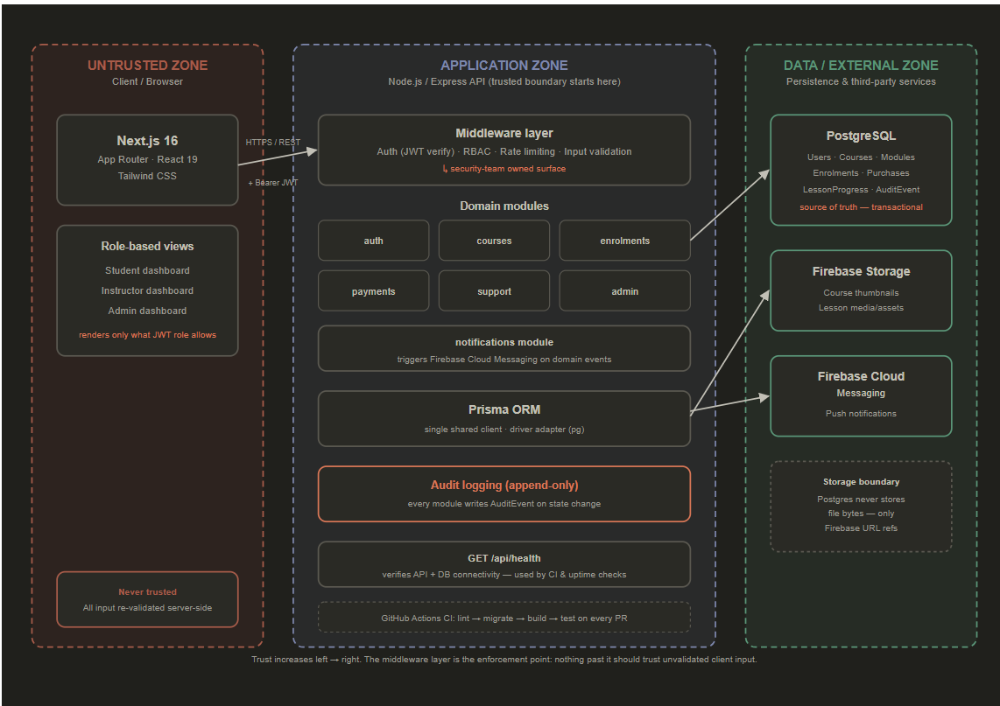
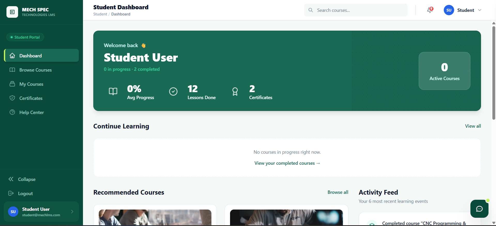
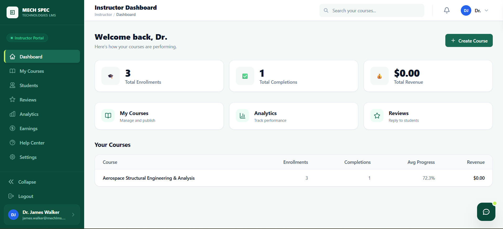
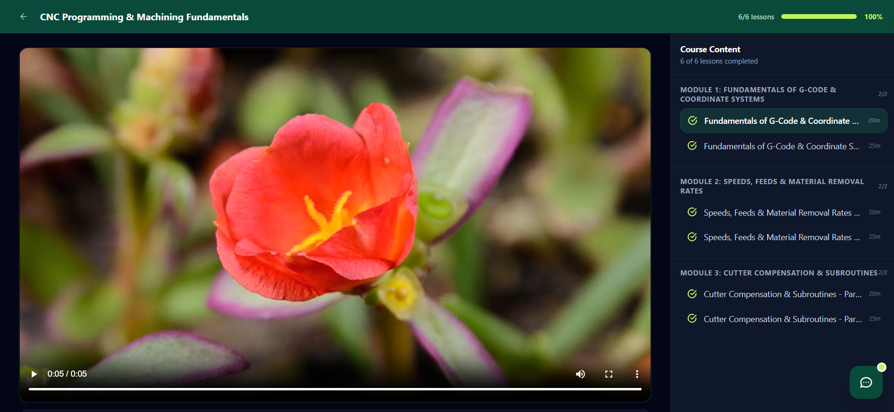
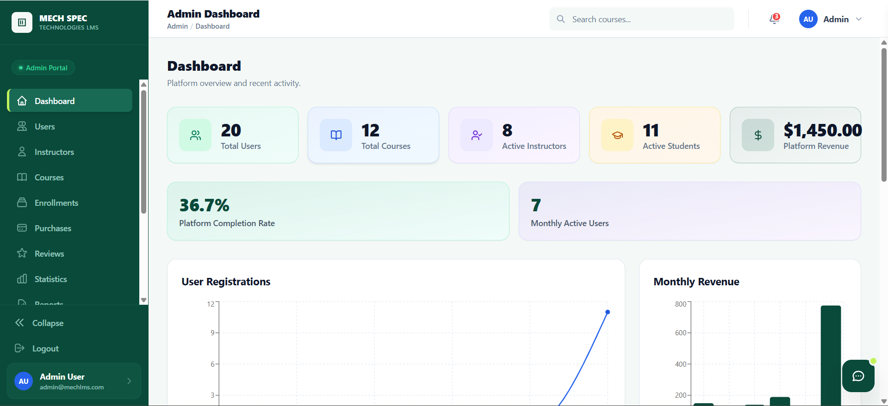

<p align="center">
  
</p>

<h1 align="center">Secure LMS MVP</h1>

<p align="center">
  <a href="https://github.com/Daniel-Dadzie/secure-lms-mvp/actions/workflows/ci.yml">
    
  </a>
  <a href="https://github.com/Daniel-Dadzie/secure-lms-mvp/actions/workflows/pr-validation.yml">
    
  </a>
  <a href="https://github.com/Daniel-Dadzie/secure-lms-mvp/actions/workflows/security.yml">
    
  </a>
  <a href="https://github.com/Daniel-Dadzie/secure-lms-mvp/blob/main/LICENSE">
    
  </a>
</p>

---

## Table of Contents

- [Overview](#overview)
- [Live Demo](#live-demo)
- [Features](#features)
  - [Authentication & Security](#authentication--security)
  - [Student](#student)
  - [Instructor](#instructor)
  - [Admin](#admin)
  - [Platform](#platform)
- [Screenshots](#screenshots)
- [Tech Stack](#tech-stack)
  - [Frontend](#frontend)
  - [Backend](#backend)
  - [External Services](#external-services)
  - [Security & DevOps](#security--devops)
- [Repository Structure](#repository-structure)
- [Architecture](#architecture)
- [Security Model](#security-model)
- [Getting Started](#getting-started)
  - [Prerequisites](#prerequisites)
  - [Installation](#installation)
  - [Development](#development)
  - [Useful Commands](#useful-commands)
- [Environment Variables](#environment-variables)
- [API Documentation](#api-documentation)
- [Testing](#testing)
- [CI/CD Pipelines](#cicd-pipelines)
- [Deployment](#deployment)
- [Production Architecture](#production-architecture)
- [Production Deployment Requirements](#production-deployment-requirements)
- [Production Deployment Checklist](#production-deployment-checklist)
  - [Environment](#environment)
  - [Database](#database)
  - [Application](#application)
  - [Security](#security)
  - [Deployment](#deployment)
- [Contributing](#contributing)
- [Branch Strategy](#branch-strategy)
- [Security Reporting](#security-reporting)
- [Project Documentation](#project-documentation)
- [License](#license)

---

## Overview

Secure LMS MVP is a security-first, role-based Learning Management System supporting **Students**, **Instructors**, and **Admins**.

The platform provides an end-to-end course lifecycle — from course discovery and enrolment to payments, progress tracking, quizzes, instructor analytics, notifications, and platform administration.

The system is built around a hardened **Node.js/Express backend**, **Next.js frontend**, and **PostgreSQL database**, with security controls integrated throughout the application and development lifecycle.

Security features include strict authentication and authorization, input validation, rate limiting, audit logging, secure HTTP headers, payment webhook verification, secret scanning, dependency auditing, and Static Application Security Testing (SAST).

---

## Live Demo

The production deployment is available through the links below.

| Component | Link |
|---|---|
| 🌐 Web Application | [Open Secure LMS](https://your-frontend-url.com) |
| ⚙️ Backend API | [API Server](https://your-backend-url.com) |
| 📚 API Documentation | [OpenAPI Documentation](https://your-backend-url.com/api-docs) |

> **Note:** Replace the placeholder URLs above with the actual production URLs after deployment.

Protected Student, Instructor, and Admin functionality requires authentication.

---

## Features

### Authentication & Security

- User registration and email verification
- Secure login with JWT access and refresh tokens
- Password reset workflow
- Role-based access control for Students, Instructors, and Admins
- Ownership-based authorization
- Rate limiting on sensitive endpoints
- Input validation with Zod
- Security headers with Helmet
- Append-only audit logging
- Secure password hashing with bcrypt
- CORS origin restrictions
- Paystack webhook signature verification
- Secret scanning with Gitleaks
- Dependency auditing
- Static Application Security Testing with Semgrep

### Student

- Browse and search courses
- Course enrolment
- Shopping cart
- Coupon support
- Paystack payment checkout
- Course progress tracking
- Quizzes and assessments
- Course reviews and ratings
- Notifications
- Student dashboard
- Course learning interface

### Instructor

- Course creation and management
- Course publishing workflow
- Course thumbnails and media uploads
- Student analytics
- Course analytics
- Earnings and performance tracking
- Instructor dashboard
- Student-instructor support messaging

### Admin

- Platform-wide analytics
- User management
- Course management
- Category management
- Instructor management
- Help article management
- Audit and security visibility

### Platform

- PostgreSQL-backed transactional data
- Cloud media storage with Cloudinary
- Firebase storage and push notifications
- Firebase Cloud Messaging
- OpenAPI API documentation
- Automated CI/CD
- Automated secret scanning
- Dependency auditing
- Static Application Security Testing

---

## Screenshots

### Student Dashboard

<p align="center">
  
</p>

### Instructor Dashboard

<p align="center">
  
</p>

### Course Learning Interface

<p align="center">
  
</p>

### Admin Dashboard

<p align="center">
  
</p>

---

## Tech Stack

### Frontend

<p align="left">
  
  
  
  
  
  
</p>

### Backend

<p align="left">
  
  
  
  
  
  
</p>

### External Services

<p align="left">
  
  
  
  
  
</p>

### Security & DevOps

<p align="left">
  
  
  
  
  
</p>

---

## Repository Structure

```text
secure-lms-mvp/
├── client/                                  # Next.js frontend
│   ├── src/
│   │   ├── app/                             # Next.js App Router
│   │   │   ├── (auth)/                      # Authentication pages
│   │   │   ├── (classroom)/                 # Student learning experience
│   │   │   ├── (dashboard)/                 # Student, instructor, and admin dashboards
│   │   │   └── (public)/                    # Public-facing pages
│   │   ├── components/                      # Shared React UI components
│   │   ├── config/                          # Frontend configuration
│   │   ├── hooks/                           # Custom React hooks
│   │   ├── lib/                             # Client utilities and API helpers
│   │   ├── store/                           # Zustand state stores
│   │   ├── test/                            # Frontend test utilities and setup
│   │   └── types/                           # Shared frontend TypeScript types
│   └── vitest.config.ts                     # Frontend test configuration
│
├── server/                                  # Express backend
│   ├── src/
│   │   ├── config/                          # Database and external service configuration
│   │   │   ├── cloudinary.ts
│   │   │   ├── email.ts
│   │   │   ├── firebase.ts
│   │   │   ├── jwt.ts
│   │   │   ├── paystack.ts
│   │   │   └── prisma.ts
│   │   ├── lib/                             # Shared backend utilities
│   │   ├── middleware/                      # Authentication, RBAC, validation, uploads
│   │   ├── modules/                         # Domain-driven application modules
│   │   │   ├── admin/
│   │   │   ├── auth/
│   │   │   ├── cart/
│   │   │   ├── categories/
│   │   │   ├── coupons/
│   │   │   ├── courses/
│   │   │   ├── enrolments/
│   │   │   ├── help/
│   │   │   ├── instructor-analytics/
│   │   │   ├── instructor-portal/
│   │   │   ├── instructors/
│   │   │   ├── notifications/
│   │   │   ├── payments/
│   │   │   ├── progress/
│   │   │   ├── quizzes/
│   │   │   ├── reviews/
│   │   │   ├── search/
│   │   │   ├── students/
│   │   │   ├── support/
│   │   │   ├── uploads/
│   │   │   └── users/
│   │   ├── services/                        # Cross-domain services
│   │   ├── app.ts                           # Express application configuration
│   │   ├── env.ts                           # Environment validation
│   │   └── server.ts                        # HTTP server bootstrap
│   │
│   ├── prisma/
│   │   ├── migrations/                      # Database migrations
│   │   ├── schema.prisma                    # Prisma database schema
│   │   └── seed.ts                          # Demo/test data seeding
│   │
│   └── tests/
│       ├── helpers/                         # Test helpers and fixtures
│       ├── integration/                     # Integration and security tests
│       ├── unit/                            # Unit tests
│       └── setup.ts                         # Test environment setup
│
├── packages/
│   └── shared/                              # Shared types and validation schemas
│
├── docs/
│   ├── api/
│   │   └── openapi.yaml                     # OpenAPI 3.0 API contract
│   ├── architecture/                        # System architecture and ERD
│   └── security/                            # Security documentation and evidence
│
├── .github/
│   └── workflows/
│       ├── ci.yml                           # Lint, build, test, and dependency audit
│       ├── pr-validation.yml                # PR security validation
│       └── security.yml                     # Security scanning pipeline
│
├── docker-compose.yml                       # PostgreSQL and Adminer
├── Makefile                                 # Developer command shortcuts
├── .env.example                             # Environment variable template
├── CONTRIBUTING.md                          # Contribution guidelines
├── LICENSE
└── README.md                                # Project documentation
```

---

## Architecture

The backend follows a **modular monolith architecture**.

Each domain concern is isolated within its own module under:

```text
server/src/modules/
```

| Module | Responsibility |
|---|---|
| `auth` | Registration, login, email verification, password reset |
| `users` | User profile management |
| `courses` | Course CRUD, thumbnails, publishing, search |
| `categories` | Course categorization |
| `enrolments` | Student course enrolment lifecycle |
| `progress` | Lesson completion and progress tracking |
| `quizzes` | Quiz creation, attempts, and scoring |
| `cart` | Shopping cart management |
| `coupons` | Discount coupon validation |
| `payments` | Paystack checkout and webhook verification |
| `reviews` | Course ratings and reviews |
| `instructors` | Instructor onboarding and management |
| `instructor-portal` | Instructor dashboard workflows |
| `instructor-analytics` | Earnings, engagement, and performance metrics |
| `students` | Student dashboard and learning workflows |
| `admin` | Platform-wide administration and analytics |
| `search` | Course and content search |
| `notifications` | In-app and FCM push notifications |
| `support` | Messaging between students and instructors |
| `help` | Help article management |
| `uploads` | Signed URL generation for media |

---

## Security Model

Security is implemented as a layered defense model across the application.

| Control | Implementation |
|---|---|
| HTTP Security Headers | Helmet with CSP, HSTS, X-Frame-Options |
| CORS | Restricted to configured client origin with credentials |
| Rate Limiting | `express-rate-limit` on sensitive endpoints |
| Authentication | JWT access tokens (15 min) + refresh tokens (7 days) |
| Password Storage | bcrypt hashing |
| Input Validation | Zod schemas on incoming requests |
| Authorization | RBAC using `requireRole` and `requireOwnership` middleware |
| Payment Integrity | Paystack webhooks verified using HMAC signatures |
| Secret Scanning | Gitleaks on every PR and push |
| Dependency Auditing | `npm audit` with high-severity checks |
| Static Analysis | Semgrep security rules |
| Audit Logging | Append-only `AuditEvent` records |

Additional security documentation and evidence are maintained under:

```text
docs/security/
```

---

## Getting Started

### Prerequisites

Before running the project locally, make sure the following are installed:

- Node.js 24.x
- npm
- PostgreSQL 16 or Docker
- Git
- Cloudinary account
- Firebase project
- Paystack account

The project uses the Node.js version specified in `.node-version`.

---

### Installation

Clone the repository:

```bash
git clone https://github.com/Daniel-Dadzie/secure-lms-mvp.git
cd secure-lms-mvp
```

Install dependencies:

```bash
npm install
```

Start PostgreSQL and Adminer using Docker:

```bash
make docker-up
```

Configure environment variables:

```bash
cp .env.example .env
```

Then edit `.env` and provide the required credentials.

Run Prisma migrations:

```bash
make migrate
```

Seed the database with demo data if required:

```bash
make seed
```

---

### Development

Run both the frontend and backend:

```bash
make dev
```

Or run them individually.

Frontend:

```bash
make dev-client
```

Available at:

```text
http://localhost:3000
```

Backend:

```bash
make dev-server
```

Available at:

```text
http://localhost:4000
```

---

### Useful Commands

| Command | Description |
|---|---|
| `make dev` | Run client and server |
| `make dev-client` | Run Next.js frontend |
| `make dev-server` | Run Express backend |
| `make lint` | Run linting across workspaces |
| `make test` | Run all tests |
| `make build` | Build applications for production |
| `make studio` | Open Prisma Studio |
| `make migrate` | Run Prisma migrations |
| `make seed` | Seed demo data |
| `make docker-up` | Start Docker services |
| `make docker-down` | Stop Docker services |

---

## Environment Variables

Environment variables are documented in:

```text
.env.example
```

### Core Variables

| Variable | Purpose |
|---|---|
| `DATABASE_URL` | PostgreSQL connection string |
| `JWT_ACCESS_SECRET` | JWT access-token signing secret |
| `JWT_REFRESH_SECRET` | JWT refresh-token signing secret |
| `CLOUDINARY_*` | Cloudinary configuration |
| `FIREBASE_*` | Firebase Admin configuration |
| `NEXT_PUBLIC_FIREBASE_*` | Firebase client configuration |
| `PAYSTACK_*` | Paystack payment configuration |
| `SMTP_*` | SMTP email configuration |
| `RESEND_*` | Resend email configuration |
| `CLIENT_URL` | Allowed frontend origin for CORS |

> **Security:** Never commit `.env` files, API keys, private keys, JWT secrets, database credentials, or other sensitive configuration to the repository.

---

## API Documentation

The API contract is defined using the **OpenAPI 3.0 specification**.

The specification is located at:

```text
docs/api/openapi.yaml
```

After deployment, the production API documentation should be available through the backend deployment URL.

Example:

```text
https://your-backend-url.com/api-docs
```

The production API documentation link should also be added to the **Live Demo** section at the top of this README.

---

## Testing

The project uses multiple testing layers.

| Layer | Framework | Purpose |
|---|---|---|
| Backend | Vitest + Supertest | API and integration testing |
| Frontend | Vitest + React Testing Library | Component and UI testing |
| Security | Vitest + Supertest + Semgrep | Security control validation |

Run the complete test suite:

```bash
make test
```

Tests run against a dedicated test database:

```text
secure_lms_test
```

Ephemeral JWT secrets are generated during test execution.

---

## CI/CD Pipelines

The project uses GitHub Actions for continuous integration, pull-request validation, and security automation.

| Workflow | Trigger | Purpose |
|---|---|---|
| CI | Push / PR to `main` | Lint → Prisma generate → DB sync → Build → Test → npm audit |
| PR Validation | PR opened / synchronized | Gitleaks secret scan → Semgrep SAST → Evidence packaging |
| Security Pipeline | Push / PR to `main` / `develop` | Gitleaks → npm audit → Semgrep blocking rules |

---

## Deployment

The application supports flexible deployment patterns, including:

| Component | Recommended Platform |
|---|---|
| Frontend | Vercel |
| Backend | Render or AWS EC2 |
| Database | Managed PostgreSQL / Amazon RDS |
| Media Storage | Cloudinary |
| Push Notifications | Firebase Cloud Messaging |
| Reverse Proxy | Nginx for EC2 deployments |
| Process Management | PM2 for EC2 deployments |
| SSL | Let's Encrypt for EC2 deployments |

For the recommended modular deployment:

```text
Next.js Frontend → Vercel
        ↓
Express API → Render
        ↓
PostgreSQL → Managed PostgreSQL
```

---

## Production Architecture

A modular production deployment can use the following architecture:

```text
                    ┌──────────────────────┐
                    │      Users / Web     │
                    └──────────┬───────────┘
                               │
                               ▼
                    ┌──────────────────────┐
                    │   Next.js Frontend   │
                    │       Vercel         │
                    └──────────┬───────────┘
                               │
                               │ HTTPS / API
                               ▼
                    ┌──────────────────────┐
                    │    Express Backend   │
                    │    Render / EC2      │
                    └──────────┬───────────┘
                               │
              ┌────────────────┼─────────────────┐
              │                │                 │
              ▼                ▼                 ▼
       ┌─────────────┐  ┌─────────────┐  ┌──────────────┐
       │ PostgreSQL  │  │  Cloudinary │  │   Firebase   │
       │  Database   │  │    Media    │  │ FCM / Storage│
       └─────────────┘  └─────────────┘  └──────────────┘
                               │
                               ▼
                       ┌──────────────┐
                       │   Paystack   │
                       │   Payments   │
                       └──────────────┘
```

---

## Production Deployment Requirements

Production deployment requires:

- PostgreSQL database
- Node.js runtime
- Production environment variables
- Secure JWT secrets
- Live Paystack keys
- `NODE_ENV=production`
- Firebase configuration
- Cloudinary configuration
- Correct CORS configuration
- Payment webhook configuration
- HTTPS
- Secure database credentials

For EC2 deployments, additionally configure:

- Nginx
- PM2
- SSL certificates using Let's Encrypt
- Firewall/security group rules
- Production process monitoring

---

## Production Deployment Checklist

Before declaring the application production-ready, verify the following.

### Environment

- [ ] Configure production environment variables
- [ ] Set `NODE_ENV=production`
- [ ] Generate strong JWT secrets
- [ ] Configure production database
- [ ] Configure Firebase
- [ ] Configure Cloudinary
- [ ] Configure Paystack live credentials
- [ ] Configure production email provider

### Database

Run Prisma migrations:

```bash
npx prisma migrate deploy
```

Generate Prisma client:

```bash
npx prisma generate
```

Then verify:

- [ ] Database connectivity
- [ ] Required database indexes
- [ ] Production schema
- [ ] Production seed requirements, if applicable

### Application

- [ ] Build frontend
- [ ] Build backend
- [ ] Verify production environment configuration
- [ ] Verify API health endpoint
- [ ] Verify authentication
- [ ] Verify role-based authorization
- [ ] Verify course creation and publishing
- [ ] Verify enrolment
- [ ] Verify payments
- [ ] Verify Paystack webhooks
- [ ] Verify media uploads
- [ ] Verify email delivery
- [ ] Verify Firebase notifications

### Security

- [ ] Verify CORS configuration
- [ ] Verify security headers
- [ ] Verify rate limiting
- [ ] Verify JWT expiration
- [ ] Verify refresh-token behavior
- [ ] Verify input validation
- [ ] Verify ownership authorization
- [ ] Verify audit logging
- [ ] Run dependency audit
- [ ] Run Gitleaks
- [ ] Run Semgrep

### Deployment

- [ ] Configure HTTPS
- [ ] Configure production domain
- [ ] Configure DNS
- [ ] Configure reverse proxy if using EC2
- [ ] Configure PM2 if using EC2
- [ ] Verify frontend-to-backend communication
- [ ] Verify production API documentation
- [ ] Verify application health after deployment
- [ ] Update the Live Demo URLs in this README

---

## Contributing

Please read [`CONTRIBUTING.md`](CONTRIBUTING.md) before contributing to the project.


### Quick Contribution Checklist

1. Create a branch from `main` using the appropriate prefix.
2. Make small, focused commits with present-tense messages.
3. Ensure the following pass locally:

```bash
make lint
make test
make build
```

4. Open a pull request.
5. At least one review is required before merging.
6. If modifying authentication, RBAC, payments, validation, or other security-sensitive functionality, request review from a cybersecurity reviewer.

---

## Branch Strategy

The project uses protected branches and pull-request-based development.

Recommended branch naming:

```text
feature/course-search
feature/student-dashboard
fix/payment-webhook
fix/authentication
security/rate-limit
security/cors-hardening
refactor/course-module
docs/api-documentation
```

Direct pushes to protected branches should be avoided where branch protection rules are enabled.

---

## Security Reporting

Security vulnerabilities should not be disclosed publicly through GitHub Issues or pull requests.

For security-related issues, follow the project's security reporting process documented in the repository.

Security documentation and evidence are maintained under:

```text
docs/security/
```

---

## Project Documentation

| Documentation | Location |
|---|---|
| API Specification | [`docs/api/openapi.yaml`](docs/api/openapi.yaml) |
| Architecture | [`docs/architecture/`](docs/architecture/) |
| Security Documentation | [`docs/security/`](docs/security/) |
| Contribution Guide | [`CONTRIBUTING.md`](CONTRIBUTING.md) |
| License | [`LICENSE`](LICENSE) |

---

## License

**Private — All rights reserved.**

This project is proprietary. Unauthorized copying, distribution, modification, or commercial use is prohibited unless explicitly authorized by the project owner.

---

<p align="center">
  <strong>Secure LMS MVP</strong>
</p>

<p align="center">
  Built with Next.js, Node.js, Express, PostgreSQL, Prisma, and modern security practices.
</p>